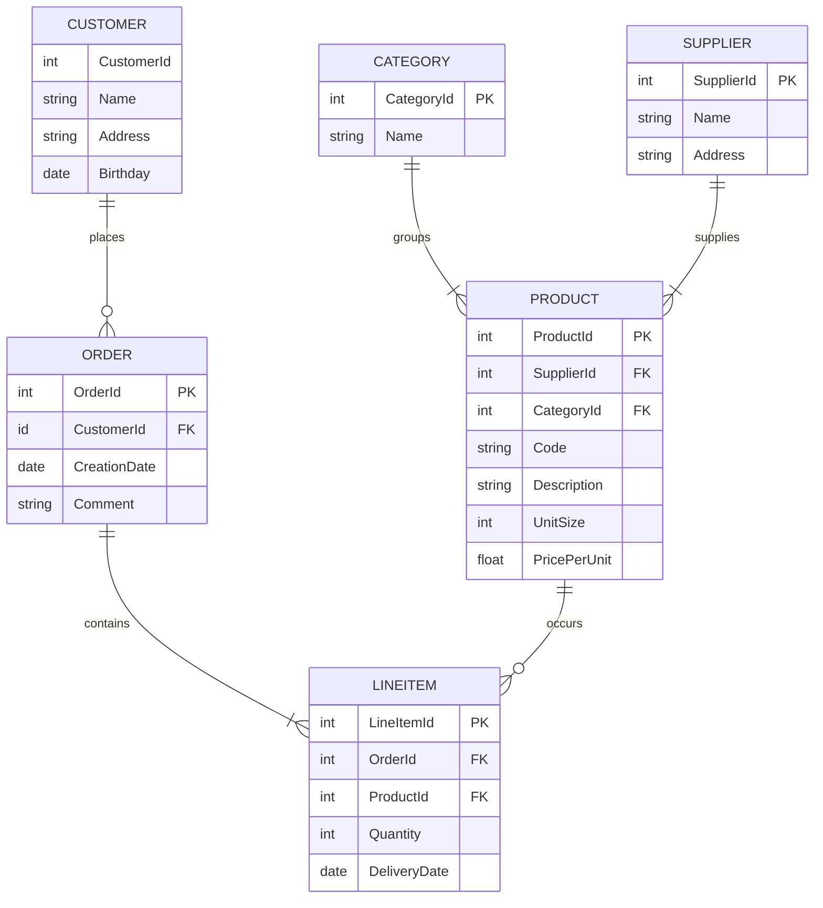

# Abstract
The goal of this project is to analyse the differences of relational and graph-based database management systems. The representatives used as concrete implementation of these two paradigms will be PostgreSQL (relational) and Neo4j (graph-based).

The first part of this work will elaborate the background of these technologies with focus on the history, popular use cases, as well as (dis)advantages. Furthermore, the key differences will be outlined in the applicable query languages, namely SQL and Cypher.

The main part is dedicated to a setup and execution of a benchmarking test. The goal is to measure and compare the performances of standard database statements used to create, read, update, and delete data. Therefore, a test console application was developed using [Go](https://go.dev/) in order to consistently and automatically test the given statements with database instances running in [Docker](https://www.docker.com/).

Finally, the benchmarking results are consolidated and interpreted. The findings will be discussed alongside with concrete recommendations in order to facilitate future decision on the given database paradigm.

# Relational Database Systems `20%`
- History
- Use Cases
- (Dis)Advantages

Relational databases belong to the most popular database managemenst systems (DBMS) nowadays. Every computer science freshman will address this data storage paradigm in a early stage and everybody in the professional world that relies on computer systems has most probabaly had (un)consciously interacted with it before. Storing data in a relational manner first of all means that every piece of unique information ideally is only stored once in our database and then referenced multiple times to wherever it is required to be. This referencing works with so-called primary and foreign keys. The following example describes such a relationally linked data structure by means of marchandising use case.

Possible Entity Relationship Diagram of a Merchant's Database

Each box represents an *entity*. The the connecting lines specify the *relationships* between the entities, whereas the line endings describe the corresponding *cardinality* represented in [Crow's Foot Notation](https://vertabelo.com/blog/crow-s-foot-notation/). A customer, for instance, can place zero or many orders. Each order contains at least one line item. A supplier, on the other hand, delivers one or more product, while each product belongs to exactly one category. Finnaly, a product can occure zero or many times in the great list of line items.

With this relational data structure, the absence of informational redundancy is ensured. In the context of DBMS, the structure is referred to as *schema* and the process of designing it called *database normalization*.

# Graph-Based Database Systems `20%`
- History
- Use Cases
- (Dis)Advantages

# Query Languages `20%`
- General way of working
- Data Definition Language
- Data Manipulation Language

# Benchmark `40%`
- Intro
- Important to Know (e.g. warm up, caching, etc.)

## Strategy and Goals
- Explanation of Automatised Tests 
- Evaluation Criteria (Performance)

## Setup
- Hardware
- Software
- system setup (docker, etc.)
- Sample Data

## Results
- Consolidation
- Interpretation

# Discussion
- Are Graph-Based really always better?

# Acknowledgements
Thanks to Simon Jürgensmeyer for his work on [dbbench](https://github.com/sj14/dbbench), which according to him was initially ispired by [Fale's post]([Fale](https://github.com/cockroachdb/cockroach/issues/23061#issue-300012178)), [pgbench](https://www.postgresql.org/docs/current/pgbench.html) and [MemSQL's dbbench](https://github.com/memsql/dbbench). His project served as a basis for this work.