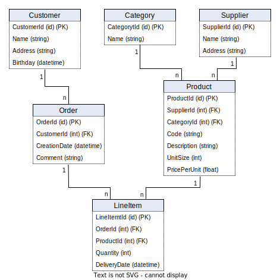
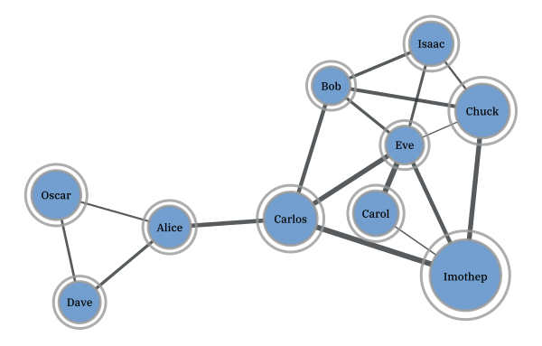
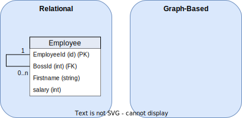

<p align="center">  </p>


>*This project was created during the database seminar at the Eastern Switzerland University of Applied Science as part of the MSE Computer Science program. To receive an overview, please see [this presentation](https://romanboegli.github.io/godbbench/)*.


</br>

**Table of Contents**

- [Abstract](#abstract)
- [Relational Database Systems](#relational-database-systems)
- [Graph-Based Database Systems](#graph-based-database-systems)
- [Query Languages](#query-languages)
- [Benchmark](#benchmark)
  * [General Considerations](#general-considerations)
    + [Domain-Specific](#domain-specific)
    + [Repeated Execution](#repeated-execution)
    + [Geometric Mean](#geometric-mean)
    + [Further Considerations](#further-considerations)
  * [System Setup](#system-setup)
    + [Docker](#docker)
    + [Go](#go)
    + [Source Code of `godbbench`](#source-code-of-tool)
  * [Running Benchmarks](#running-benchmarks)
    + [Synthetic Mode](#synthetic-mode)
    + [Statement Substitutions](#statement-substitutions)
    + [Custom Script Mode](#custom-script-mode)
    + [Result Visualisation](#result-visualisation)
    + [Further Automation](#further-automation)
  * [Showcase](#showcase)
    + [System Specifications](#system-specifications)
    + [Script Strategy](#script-strategy)
    + [Results](#results)
- [Discussion](#discussion)
- [Acknowledgements](#acknowledgements)
- [References](#references)


</br>
</br>

# Abstract
The goal of this project is to analyze the differences between relational and graph-based database management systems. The representatives used as concrete implementation of these two paradigms will be MySQL & PostgreSQL (relational) and Neo4j (graph-based).

The first part of this work will elaborate on the background of these technologies with a focus on the history, popular use cases, as well as (dis)advantages. Furthermore, the key differences will be outlined in the applicable query languages, namely SQL and Cypher.

The main part is dedicated to a setup and execution of a benchmarking test. The goal is to measure and compare the performances of standard database statements used to create, read, update, and delete data. Therefore, a test console application was developed using [Go](https://go.dev/) in order to consistently and automatically test the given statements with database instances running in [Docker](https://www.docker.com/).

Finally, the benchmarking results are consolidated and interpreted. The findings will be discussed alongside concrete recommendations in order to facilitate future decisions on the given database paradigm.


# Relational Database Systems
Relational databases belong to the most popular database management systems (DBMS) nowadays. Every computer science freshman will address this data storage paradigm in an early stage and everybody in the professional world that relies on computer systems has most probably had (un)consciously interacted with it before. It was first introduced by Ted Codd in 1970 [[1]](#1). Roughly ten years later, its first commercial model became available in form of IBM's Orcale DBMS. Micorosft followed with its own products such as SQLServer and Access. Besides this, free and open-source solutions like MySQL and PostgreSQL started to emerge [[2]](#2). 

Nowadays, the term *post-relational* DBMS is also used for these types of DB systems to emphasize the fact that data storing techniques are not exclusively constrained to relationally linked tables. Data may also be stored in other forms, for instance, JSON, key-value-pairs or document-oriented. Since these alternative storage approaches may not at all or only partially work with SQL, the term *NoSQL* evolved. Thus, its meaning can be interpreted literally (*"No SQL"*) or as *"Not Only SQL"*. For the sake of simplicity, however, this project continues to use the term *relational* in this context.

Relationally storing data first and foremost means that every piece of unique information ideally is stored only once in our database and then referenced multiple times to wherever it is required to be. This referencing works with so-called primary keys (PK) and foreign keys (FK), where the latter serves as a pointer to the actual information. The following example describes such a relationally linked data structure utilizing a merchant use case.

<h6 align="center">Possible Entity-Relationship Diagram of a Merchant's Database</h6>
<p align="center">  </p>

Each box in this entity-relationship diagram (ERD) represents an *entity*, which is in practice nothing else than a table where each row describes a distinct tuple. The listed attributes in the boxes correspond to the columns of the table, also known as *attributes*. The connecting lines specify the *relationships* between the entities. The relationships also indicate *cardinality*. A customer, for instance, can place zero or any amount of orders. Each order contains at least one line item. A supplier, on the other hand, delivers one or more products, while each product belongs to exactly one category. Finally, a product can occur zero or many times in the great list of line items.

With this relational data structure, the absence of informational redundancy is ensured. In the context of DBMS, the structure is referred to as *schema*, and the process of designing is called *database normalization*. Working with normalized data is not only storage efficient but also allows keeping the operational costs that might occur when updating information at a minimum. Imagine a concrete product has been ordered many thousand times and suddenly, the merchant would like to rename this product. Thanks to the relational structure, the update operation will only affect one single storage cell, namely in the product entity on the corresponding row-column intersection. The thousandfold mentions of this product in the line item entity will remain unaffected as the referencing foreign key `ProductId` will not change. Only the referenced information does.

Common use cases for relational DBMS include data scenarios that are well known, depict clear relationships and entail little changes over time. All aspects are given in the merchant example above. Other examples may include the data scenarios of payment processors, storehouses or facility management. As a merchant, the versatility of the storable information is quite concluding. This allows to quite thoroughly specify the entities, their attributes and relationships in advance. From this, the data structure can be derived which is in relational DBMS referred to as *schema*.

Once a database has been initiated with a schema, one can start storing and querying information. Retroactive changes to this schema are still possible but can induce challenges. Imagine adding another attribute to an already existing table with millions of data records in it. This new column will store a foreign key to a new entity that holds category types, as new data records can from now on be categorized. For the sake of completeness, however, this schema manipulation must also include a major data update in order to retrospectively categorise the already existing data records in this table. This directly poses the question if the correct category is always derivable. This example illustrates the complexity of retrospective schema manipulations.

On the other hand, can the rigidness of relational DBMS also be seen as an advantage. Every software engineer that is responsible for implementing the business logic and presentation layer for an application appreciates a definite and rather complete definition of the data ensemble. Little schema changes are often followed by major source code changes which can be costly.


# Graph-Based Database Systems
With rising trends in amounts and connections of data, the classic relational database management systems seemed not to be the ideal choice. In the field of mathematics, graph theory was already established and algorithms to assess networks of connected nodes became more and more popular. The core business model of emerging companies such as Twitter or Facebook was and still is based on data that can be represented ideally as graphs. For instance, think of friendship relations among people as shown in the figure below. Every person represents a node and the connecting lines (a.k.a. edges) indicate the friendship relations among them. The nodes are attributed be the person's name and the thickness of the edges describes, for instance, how close this friendship is.

<h6 align="center">Friendships as Weighted Graph <a href="#3">[3]</a></h6>
<p align="center">  </p>

Capturing graph-based data domains in a relational DBMS invokes certain limitations regarding ease of querying, computational complexity, and efficiency [[4]](#4). Graph-based database systems overcome these limitations as they store such graph-based information natively. A popular implementation of such a system is [Neo4j](https://neo4j.com/). Other than in relational DBMS, Neo4j allows heterogeneous sets of attributes on both nodes and relationships. This implies that there is also no database schema to be specified beforehand. One simply creates attributed nodes and the also attributed relationships among them in order to start working with a graph database [[5]](#5).

One of the most remarkable advantages is the application of graph algorithms as they are uniquely well suited to reveal and understand patterns in highly connected datasets. Possible real-world problems may include uncovering vulnerable components in a network, discovering unseen dependencies, identifying bottlenecks, revealing communities based on behavior patterns, or specifying the cheapest route through a network [[6]](#6).

Although it is technically possible to always use a relational DBMS when working with a highly connected data scenario, lots of work can be simplified using graph-based DBMS. This is especially appreciable when working with recursion, different result types or path-finding problems [[7]](#7). The latter is especially useful in use cases such as direction finding for geographic applications, optimizations in supply chain systems, bottleneck determination in computer networks or fraud detection.

On the other hand, graph-based DBMS also bear certain disadvantages. First, there is no unified query language to work with and the ones that exist rather unknown due to their recency. This can have a major impact on real-world applications as companies and the developers working for them most probably prefer the technology that they already know and will be able to support in the long run. Furthermore, the high degree of flexibility due to the absence of a schema invokes the costs of missing referential integrity and normalization. This makes graph-based DBMS less suitable for high integrity systems as they exist in the financial industry for example [[8]](#8).


# Query Languages
The communication language for relational DBMS is called *Structured Query Language* (SQL). Although each DBMS has its own slightly different SQL implementation, so-called dialects, the language follows a standard that is broadly known among developers and database engineers. SQL statements can be structured into three subdivisions, namely Data Definition Language (DDL), Data Manipulation Language (DML) and Data Control Language (DCL)[[9]](#9). The following table specified the associated database operations for each subdivision.

Subdivision | Database Operations
:-----------|:--------------------------------
DDL         | `CREATE`, `ALTER`, `DROP`, `TRUNCATE`
DML         | `SELECT`, `INSERT`, `UPDATE`, `DELETE`
DCL         | `GRANT`, `REVOKE`, `COMMIT`, `ROLLBACK`

The fundamentally different paradigm in graph-based DBMS requires different communication languages. Neo4j for example implemented the expressive and compact language called *Cypher* which has a close affinity with the common graph representation habit. This facilitates the programmatic interaction with property graphs. Other languages are *[SPARQL](https://www.w3.org/TR/rdf-sparql-query/)* or *[Gremlin](https://github.com/tinkerpop/gremlin/wiki)*  which are, however, not further discussed in this work. 

The two languages SQL and Cypher exhibit significant differences in their statement formulation, as the following examples show. 

```sql
-- SQL
SELECT * FROM Customer c WHERE c.Age >= 18

-- Cypher
MATCH (c:Customer) WHERE c.Age > 18 RETURN c;
```

The simple selection of a set of customers seems in both languages natural. It is important to understand, however, that the SQL statement addresses a specific entity, i.e. table, called `Customer`, while the Cypher version matches all nodes in with the label `Customer`.

Cypher's elegance predominates when more than one entity is involved, as shown in the next example.

```sql
-- SQL
SELECT c.CustomerId, c.Name, SUM(p.Total)
FROM Customer c INNER JOIN Purchase p on c.CustomerId = p.CustomerId 
GROUP BY c.CustomerId, c.Name 
ORDER BY SUM(p.Total) DESC

-- Cypher
MATCH (c:Customer)-[:MAKES]->(p:Purchase)
RETURN c.Name, SUM(p.Total) AS TotalOrderValue 
ORDER BY TotalOrderValue DESC
```

The SQL approach involves joining the `Purchase` entity via the explicitly stated mapping key `CustomerId`. Furthermore, the usage of the aggregation function `SUM`requires the subsequent `GROUP BY` clause to become a valid statement. In Cypher, however, joining is done using the (attributed) arrow clause `-->` which simply indicates a relationship and no grouping clause is required in order to benefit from aggregation functions.


# Benchmark
The beginning of this chapter covers general considerations regarding database benchmarks. Subsequently, it guides through the required system setup in order to start benchmarking with `godbbench`. Some examples are shown how to create custom scripts and visualize the resulting measurements. Lastly, a whole showcase called `employees` is presesented using further automation via a bash-script.

## General Considerations
Benchmarking allows testing a system's performance in a controlled and repeatable manner. Reasons to conduct benchmarks may include system design, proofs of concepts, tuning, capacity planning, troubleshooting or marketing [[10]](#10). To conduct a thoughtful and unbiased benchmark, multiple points must be considered. This chapter will give an overview of the most important considerations alongside the argumentation of how these challenges are counteracted in `godbbench`.

### Domain-Specific
The Benchmark Handbook by Jim Gray emphasizes the need for domain-specific benchmarks as the diversity of computer systems is huge [[11]](#11). Since each computer system is usually designed for a few domain-specific problems, there exists no global metric to measure the system performance for later comparison. Thus it is crucial also to work with domain-specific benchmarks in order to receive meaningful insights. Additionally, such benchmarks should meet four important criteria, namely:

- **Relevancy:** Benchmark must measure the peak performance when performing typical operations within that problem domain.
- **Portability:** Benchmark must be easy to implement on different systems and architectures.
- **Scalability:** Benchmark must be applicable on small to large systems.
- **Simplicity:** Benchmark must be understandable in order to not lack credibility.

One key feature of `goddbbench` is the allowance of custom database scripts. This allows the creators of these scripts to capture the domain-specific data scenario. Statements or transactions in these scripts are prepended with special tags. These tags allow parts of the script to be named which facilitates the result analysis in a later step. Furthermore, tags can specify the number of times a certain statement should be executed. Examples will be given in later chapters.

### Repeated Execution
Relational as well as graph-based DBMS improve the performance by design using execution plans and cached information. Therefore a single execution of a single query is hardly meaningful. The database should rather be stressed with thousands of statement executions, for instance querying the purchasing history of customers based on their randomly chosen identification number. This not only simulates real-world requirements on the DBMS, it also allows the system to *warm-up* and mitigates the benefits of cached information [[4]](#4).

Each benchmark performed with `goddbbench` requires the indication of the number of iterations, i.e. the *iteration count*. Usually, these value series follow the pattern of $10^x$. 

### Geometric Mean
Following the advice of repeated statement executions will lead to many different time measurements. In order to draw a conclusion on how fast the given DBMS could handle the task, one should not simply calculate the arithmetic mean of all the data points since it is sensitive to outliers. A better choice to mathematically consolidate the measurements would be the geometric mean which can also be applied to unnormalized data [[12]](#12). It is defined as followed:

<h6 align="center">Geometric Mean</h6>
<p align="center">  </p>

The measurements for each benchmark in `goddbbench` include the extrema (i.e. minimum and maximum time), the arithmetic and geographic mean, the time per operation as well as the number of operations per second.  For all metrics except the latter, the time unit is given in microseconds (μs).

### Further Considerations
The stated considerations up to now only scratch the surface in the field of database benchmarking. What about different deployment settings (e.g. on-premise vs. cloud), concurrent connections or running background jobs, just to name a few. The consideration of these aspects will not facilitate the process of a representational database benchmarking test. Therefore it might be helpful to consult the industry-standard database benchmarks developed by the [Transaction Processing Council (TPC)](https://www.tpc.org/). Scalzo (2018) elucidates these standards [[13]](#13).

## System Setup
Three components are required in order to use `goddbench`. These are:
- Docker to run the DBMS instances. Technically, these instances can also run somewhere else as long as the IP address and port number is known.
- The programming language `Go` to execute the tool.
- The source code of `godbbench`, i.e. a clone of this repository.

The following subchapter will give further insights into the setup process.

### Docker
Docker allows the most lightweight and easiest database setup. Download [Docker](https://www.docker.com/products/docker-desktop/) via the provided installers. To check whether the installation was successful, enter the following command to print the installed version:

```console
docker -v  # should print something like "Docker version 20..."
```

As a next step, execute the following command in order to create an instance for each DBMS focused in this project. Actually, these are three single commands but using `&&` allows concatenation. The backslashes (`\`) allow line breaks.

```console
docker run --name gobench-mysql -p 3306:3306 -e MYSQL_ROOT_PASSWORD=password -d mysql && \
docker run --name gobench-postgres -p 5432:5432 -e POSTGRES_PASSWORD=password -d postgres && \
docker run --name gobench-neo4j -p7474:7474 -p7687:7687 -e NEO4J_AUTH=neo4j/password -d neo4j
```

Docker will automatically download the required images, set up and start the containers. This is required as `godbbench` expects these DBMS to be up and running at the specified ports. 

To remove the DB containers and the associated volumes again, use the following command.

```console
docker rm -f $(docker ps -a | grep gobench-mysql | cut -f 1 -d ' ') && \
docker rm -f $(docker ps -a | grep gobench-postgres | cut -f 1 -d ' ') && \
docker rm -f $(docker ps -a | grep gobench-neo4j | cut -f 1 -d ' ') && \
docker volume prune -f
```

### Go
Download the suitable installer for the latest version on the [project's homepage](https://go.dev/dl/) and execute it. To check if the installation was successful enter `go version` in your terminal - the version should be printed.

```console
go version # should print something like "go version go1...."
```

### Source Code of `godbbench`
Either download this GitHub repository manually as ZIP file and extract it on your computer. In case [`git`](https://git-scm.com/downloads) is installed on your system, navigate to the desired storage location in your file system using the terminal and execute the following command.

```console
git clone https://github.com/RomanBoegli/godbbench.git
```

After successfully downloading the source code, navigate into the `cmd` folder. It contains the two most important files to work with. Test the communication with the tool by entering the following command in your terminal. It should print the available subcommands.

```console
go run godbbench.go # should print "Available subcommands: ..."
```

## Running Benchmarks
Once the system setup was completed, the first benchmarks can be executed. There are two possibilities to run benchmarks. The *synthetic mode* includes the execution of a few default so-called *Create-Read-Update-Delete (CRUD)* statements with a single generic entity. The other possibility would be the *custom script mode* which executes whatever is specified in an externally provided script file. Both modes allow so-called *statement substitution* which is best explained with the examples provided in the following chapter.

### Synthetic Mode
When no custom script is passed to the argument `--script`, synthetic statements are executed. So far these include very basic CRUD operations on one single (generic) entity with random values. Taking the example of PostgreSQL, the synthetic script looks like the following (similar implementation in MySQL and Neo4j adapters).

```SQL
-- synthetic INSERT
INSERT INTO godbbench.generic (genericId, name, balance, description) 
VALUES( {{.Iter}}, '{{call .RandString 3 10 }}', {{call .RandIntBetween 0 9999999}}, '{{call .RandString 0 100 }}' );

-- synthetic SELECT
SELECT * FROM godbbench.Generic WHERE GenericId = {{.Iter}};

-- synthetic UPDATE
UPDATE godbbench.Generic 
SET Name = '{{call .RandString 3 10 }}', Balance = {{call .RandIntBetween 0 9999999}} 
WHERE GenericId = {{.Iter}};

-- synthetic DELETE
DELETE FROM godbbench.Generic WHERE GenericId = {{.Iter}};
```

### Statement Substitutions
Obviously, these statements above seem not to respect the SQL standard. The declarations embraced with double curly brackets (e.g. `{{ example }}`) will be substituted using the [golang template engine](https://pkg.go.dev/text/template) right before the statement is passed to the DBMS. This allows to dynamically create random queries without specifying thousands of structurally identical SQL statements. All possible substitution commands are listed in the following table.

Declaration | Substitution
:-----------|:------------
`{{.Iter}}`| Counter that starts with 1 and ends with the specified iteration count of the given benchmark.
`{{call .RandInt64}}`|Returns a random non-negative value of type [Int64](https://pkg.go.dev/builtin#int64).
`{{call .RandFloat64}}`|Returns a random value within the interval [0.0,1.0) as [Float64](https://pkg.go.dev/builtin#float64).
`{{call .RandIntBetween 1 42}}`| Returns a random integer between 1 and 42. Input values must be a valid [Int32](https://pkg.go.dev/builtin#int32).
`{{call .RandFloatBetween 0.8 9.9}}`| Returns a random float between 0.8 and 9.9. Input values must be a valid [Float64](https://pkg.go.dev/builtin#float64).
`{{call .RandString 1 9}}`| Returns a random string with a length between 1 and 9 characters.
`{{call .RandDate}}`|Returns a random date as string (yyyy-MM-dd) between `1970-01-01` and `2023-01-01`.

In order to run the synthetic CRUD benchmarks with an iteration count of 1'000 against the running PostgreSQL Docker instance, execute the following statement.

````console
go run godbbench.go postgres --host 127.0.0.1 --port 5432 --user postgres --pass password --iter 1000
````

The benchmark results will directly be printed to your console as shown in the video below.

<h6 align="center">Example of Synthetic Benchmarks against PostgreSQL</h6>

https://user-images.githubusercontent.com/22320200/165149101-499ac3a6-a5d2-46c1-80aa-52e0397b1b40.mp4

Alternatively, the synthetic benchmarks that should be executed can also be named explicitly using the `--run` flag. This allows to only run the ones that are of interest in the given situation (e.g. `--run "inserts selects"`). The benchmark results can also be saved as CSV file by specifying a storage location, e.g. `--writecsv "./results.csv"`.

After several runs on various DBMS and with different iteration counts, the different result files located in the same folder can be merged into one single file using the following command.

```console
go run godbbench.go mergecsv --rootDir "." --targetFile "./merged.csv"
````

Finally, the following command will create a static `HTML` page that can be opened using any web browser that visualized the merged result.

```console
go run godbbench.go createcharts --dataFile "./merged.csv" # creates 'charts.html' 
````

With help of the concatenation sign `&&` all these commands can be combined and executed at once as shown below.

```console
go run godbbench.go neo4j --host 127.0.0.1 --port 7687 --user neo4j --pass password --iter 100 --writecsv "neo4j.csv" \
&& go run godbbench.go postgres --host 127.0.0.1 --port 5432 --user postgres --pass password --iter 100 --writecsv "postgres.csv" \
&& go run godbbench.go mysql --host 127.0.0.1 --port 3306 --user root --pass password --iter 100 --writecsv "mysql.csv" \
&& go run godbbench.go mergecsv --rootDir "." --targetFile "./merged.csv" \
&& go run godbbench.go createcharts --dataFile "./merged.csv"
```

<h6 align="center">Example of Concatenated Synthetic Benchmarks</h6>

https://user-images.githubusercontent.com/22320200/165149157-eb6ac0ec-3cdb-4c4b-905a-b87fa9444dd2.mp4

The collected results after that the concatenated statements have created only provide a performance comparison on one single iteration count, i.e. 1'000. One would have to extend or repeat it with higher orders of iterations, for instance 10'000, 100'000 and so forth.

### Custom Script Mode
Since the variety and quality of the synthetic benchmarks are limited to a few basic operations, it is much more recommended to test the database systems with custom scripts. This allows to not only account for a use case-specific data scenario but also to test more realistic and thus often more complex CRUD operations. 

Custom scripts require certain annotations to correctly render statements into individual benchmark tasks. Everything below such an annotation, e.g. various SQL statements delimmited with a semicolon, define a single benchmark. These annotations must follow a strict pattern which is explained below.

```code
\benchmark <once/loop>  [<0-1>]  \name  <A-Za-z0-9>
           ─────┬─────   ──┬──          ─────┬─────
                │          │                 └─ Benchmark identifier: 
                │          │                    Just a name or label for the benchmark.
                │          │                    Important for subsequent result analysis.
                │          │
                │          └─ Scale factor:
                │             Scale factor expressed as percentage to the specified 
                │             iteration count. Only relevant when looping.
                │
                └─ Case of recurrence:
                   Keyword "once" will execute the benchmark only one time, regardless of 
                   the specified iteration count. Useful for setup and teardown statements.
```

In the case of a looping benchmark, the (collection of) statement(s) subsumed below a given annotation will be executed as often as the specified scale factor of the provided `--iter` amount. The fictive script example below exemplifies this.


```sql
-- INIT
\benchmark once \name setup
-- start of benchmark 'setup'
DROP TABLE IF EXISTS mytable;
CREATE TABLE mytable (myId INT PRIMARY KEY, myName VARCHAR(20));
-- end of benchmark 'setup', will be executed one single time

-- INSERTS
\benchmark loop 0.75 \name inserts
-- start of benchmark 'inserts'
INSERT INTO mytable (myId, myName) VALUES( {{.Iter}}, '{{call .RandString 5 20 }}');
-- end of benchmark 'inserts', will be executed <75% of given iteration count> times

-- SELECTS
\benchmark loop 1.0 \name selects
-- start of benchmark 'selects'
SELECT * FROM mytable WHERE myName LIKE '%{{call .RandString 1 10 }}%';
-- end of benchmark 'selects', will be executed <100% of given iteration count> times
```

Using the example script above, the entire benchmarking procedere consists of three benchmark tasks, namely `setup`, `inserts` and `selects`. To start it, the following command would be necessary.

````console
go run godbbench.go postgres --host 127.0.0.1 --port 5432 --user postgres --pass password \
                             --iter 1000  \
                             --script "../path/to/scripts/myscript.sql"
````

The iteration count in this command is set on `1'000` using the `--iter` option. This results in the following number of excutions per benchmark.

Benchmark | Executions | Reason
:---------|:--------------------:|:---------
`setup` | 1 | Single benchmark due to `once` annoation
`inserts` | 750 | Looping benchmark with scale factor of 75%
`selects` | 1'000 | Looping benchmark with scale factor of 100%

Further examples can be found in the [script folder](./scripts/) of this project.

### Result Visualisation
Each interation of a benchmark is timed in order to measure its performance. As seen before, the individual results can be saved as CSV files and merged into one single file. The following excerpt exemplifies what such a merged result file could look like.

```code
┌───────────┬─────────────────┬──────────┬─────────────┬─────────────┬─────────────────┬───────────────┬───────────┬───────────┬────────┬────────┐
│ system    │ iteration count │ name     │ executions  │ total (μs)  │ arithMean (μs)  │ geoMean (μs)  │ min (μs)  │ max (μs)  │ ops/s  │ μs/op  │
├───────────┼─────────────────┼──────────┼─────────────┼─────────────┼─────────────────┼───────────────┼───────────┼───────────┼────────┼────────┤
│ mysql     │ 10              │ inserts  │ 10          │ 20435       │ 19431           │ 20799         │ 16618     │ 19902     │ 489    │ 2043   │
│ mysql     │ 10              │ selects  │ 10          │ 11682       │ 8637            │ 8950          │ 4639      │ 11309     │ 855    │ 1168   │
│ mysql     │ 10              │ updates  │ 10          │ 16845       │ 14353           │ 15115         │ 9305      │ 16435     │ 593    │ 1684   │
│ mysql     │ 10              │ deletes  │ 10          │ 19017       │ 16020           │ 16881         │ 9961      │ 18783     │ 525    │ 1901   │
│ mysql     │ 100             │ inserts  │ 100         │ 160652      │ 17733           │ 10315         │ 1912      │ 111225    │ 622    │ 1606   │
│ mysql     │ 100             │ selects  │ 100         │ 44790       │ 3577            │ 2494          │ 976       │ 29640     │ 2232   │ 447    │
│ mysql     │ 100             │ updates  │ 100         │ 122012      │ 13576           │ 11685         │ 2141      │ 33193     │ 819    │ 1220   │
│ mysql     │ 100             │ deletes  │ 100         │ 65382       │ 6182            │ 5818          │ 2144      │ 13177     │ 1529   │ 653    │
│ mysql     │ 1000            │ inserts  │ 1000        │ 789239      │ 11274           │ 10586         │ 3417      │ 38472     │ 1267   │ 789    │
│ mysql     │ 1000            │ selects  │ 1000        │ 314366      │ 4120            │ 3301          │ 870       │ 33581     │ 3180   │ 314    │
│ mysql     │ 1000            │ updates  │ 1000        │ 773601      │ 10667           │ 9631          │ 2210      │ 46906     │ 1292   │ 773    │
│ mysql     │ 1000            │ deletes  │ 1000        │ 490949      │ 6960            │ 6632          │ 2232      │ 19029     │ 2036   │ 490    │
│ neo4j     │ 10              │ inserts  │ 10          │ 195612      │ 173451          │ 183267        │ 110071    │ 195053    │ 51     │ 19561  │
│ neo4j     │ 10              │ selects  │ 10          │ 45374       │ 33205           │ 33367         │ 16483     │ 45277     │ 220    │ 4537   │
│ neo4j     │ 10              │ updates  │ 10          │ 105883      │ 100145          │ 107301        │ 96661     │ 105207    │ 94     │ 10588  │
│ neo4j     │ 10              │ deletes  │ 10          │ 35309       │ 25401           │ 25780         │ 14108     │ 35218     │ 283    │ 3530   │
│ neo4j     │ 100             │ inserts  │ 100         │ 833858      │ 95858           │ 77052         │ 15691     │ 329898    │ 119    │ 8338   │
│ neo4j     │ 100             │ selects  │ 100         │ 685079      │ 73109           │ 63719         │ 14835     │ 192135    │ 145    │ 6850   │
│ neo4j     │ 100             │ updates  │ 100         │ 608159      │ 66402           │ 56629         │ 13099     │ 180347    │ 164    │ 6081   │
│ neo4j     │ 100             │ deletes  │ 100         │ 541592      │ 55821           │ 49806         │ 13646     │ 140613    │ 184    │ 5415   │
│ neo4j     │ 1000            │ inserts  │ 1000        │ 3482636     │ 50148           │ 45613         │ 8727      │ 248238    │ 287    │ 3482   │
│ neo4j     │ 1000            │ selects  │ 1000        │ 3873064     │ 55643           │ 51104         │ 10384     │ 192788    │ 258    │ 3873   │
│ neo4j     │ 1000            │ updates  │ 1000        │ 3393816     │ 49276           │ 45709         │ 11202     │ 153225    │ 294    │ 3393   │
│ neo4j     │ 1000            │ deletes  │ 1000        │ 3097136     │ 44314           │ 40621         │ 8770      │ 169153    │ 322    │ 3097   │
│ postgres  │ 10              │ inserts  │ 10          │ 42880       │ 30977           │ 30125         │ 5821      │ 42170     │ 233    │ 4288   │
│ postgres  │ 10              │ selects  │ 10          │ 37178       │ 26828           │ 27351         │ 14140     │ 36999     │ 268    │ 3717   │
│ postgres  │ 10              │ updates  │ 10          │ 35324       │ 25311           │ 22674         │ 2688      │ 35163     │ 283    │ 3532   │
│ postgres  │ 10              │ deletes  │ 10          │ 38104       │ 24445           │ 19879         │ 2685      │ 37997     │ 262    │ 3810   │
│ postgres  │ 100             │ inserts  │ 100         │ 97908       │ 10035           │ 4393          │ 1489      │ 80063     │ 1021   │ 979    │
│ postgres  │ 100             │ selects  │ 100         │ 109397      │ 10711           │ 3847          │ 879       │ 75002     │ 914    │ 1093   │
│ postgres  │ 100             │ updates  │ 100         │ 110818      │ 11724           │ 6630          │ 1845      │ 59777     │ 902    │ 1108   │
│ postgres  │ 100             │ deletes  │ 100         │ 89923       │ 10452           │ 5117          │ 1042      │ 64316     │ 1112   │ 899    │
│ postgres  │ 1000            │ inserts  │ 1000        │ 787422      │ 10420           │ 5762          │ 852       │ 94569     │ 1269   │ 787    │
│ postgres  │ 1000            │ selects  │ 1000        │ 316667      │ 3745            │ 2029          │ 564       │ 129437    │ 3157   │ 316    │
│ postgres  │ 1000            │ updates  │ 1000        │ 680765      │ 8696            │ 4890          │ 864       │ 77583     │ 1468   │ 680    │
│ postgres  │ 1000            │ deletes  │ 1000        │ 492111      │ 6595            │ 4086          │ 915       │ 78401     │ 2032   │ 492    │
└───────────┴─────────────────┴──────────┴─────────────┴─────────────┴─────────────────┴───────────────┴───────────┴───────────┴────────┴────────┘
```

The file serves as a basis for any kind of subsequent data analysis or visualisation routines. One routine is already implemented in `godbbench` and can be invoked using the `createcharts` command. Most of the metrics are specified with the time unit of *microseconds*, that is `1` second (s) equals `1'000'0000` microseconds (μs). The following table explains the meaning of all available columns in this file. 

Column / Metric  | Definition           
:----------------|:---------------------
`system`         | Name of testes DBMS
`iteration count`   | Number of iterations specified at invocation time.
`name`           | The benchmark's name.
`executions`     | Number of executions the given benchmark was performed under consideration of the annotated scale factor.
`total (μs)`     | Total amount of microseconds spend for all executions of the given benchmark.
`arithMean (μs)` | Average execution time microseconds calculated using the aithmetic mean.
`geoMean (μs)`   | Average execution time microseconds calculated using the geometric mean.
`min (μs)`       | Fastest single execution.
`max (μs)`       | Slowest single execution.
`ops/s`          | Operations per second which equals `executions` divided by `total (μs)`. This is the only metric in this collection where high values are considered as good.
`μs/op`          | Microseconds per operation which equals `total (μs)` divided by `executions`.

The current implementation of the automated data visualisation using `createcharts` command only accounts for the metrics `arithMean (μs)`, `geoMean (μs)`, `ops/s` and `μs/op` for each benchmark (column `name`). The X-axsis represents the available iteration counts and the actual values are dynamically projected on the Y-axsis. The command argument `--type` also allows to alternate between a bar or a line chart, as illustrated below. Additionally, the charts introduce a few interaction possibilities as demonstrated in the animation below.

<h6 align="center">Chart Interaction Options</h6>

https://user-images.githubusercontent.com/22320200/166416480-0c8b49fc-ede3-40fb-9e5d-a245d8f6d551.mp4

### Further Automation
So far it was shown several times how `godbbench` can be used to perform benchmarks against a DBMS using synthetic or custom-created statements and a specified amount of iterations. This must then be repeated for each DBMS and iteration count which is tedious. Therefore this project also provides an automation script written in [Bash](https://www.gnu.org/software/bash/) and named [`benchmark.sh`](./cmd/benchmark.sh).

```console
bash benchmark.sh # use PowerShell when working on Windows
```

After it has started, it will loop over the provided iteration counts and run the benchmarks for all three supported DBMSs. In the end, the individual result files will be merged and immediately rendered into the mentioned charts. The following video demonstrates this.

<h6 align="center">Automation Bash Script Usage</h6>

https://user-images.githubusercontent.com/22320200/165150973-483eafcf-9be0-4c8a-b6e4-ba19c21e9fa7.mp4

Optionally, the script is also able to set-up and tear-down the dockerized database instances before respectively after each  iteration count batch. This ensures equal container conditions for each benchmarking procedure. 

## Showcase
Two examples of custom scripts already exist in this repository. The first is named [`merchant`](./scripts/merchant/) and represents the popular data scenario of a merchandising company that sells products from suppliers to their customers using orders. This use case is predestinated for a relational DBMS since due to its popular nature it is well understood and can concludingly be modeled as a database schema (see ERD image in chapter [Relational Database Systems](#relational-database-systems)). Alternations to this schema are rather unlikely which makes it legitimately rigid. Therefore one must state that running benchmarks using this biased data scenario does not provide valuable insights when comparing relational and graph-based DBMS. The reason why the `merchant` script nonetheless exists in this repository simply serves the act of establishing an understanding of how to write such custom scripts. However, this script will be disregarded during the showcase.

The second custom script example is called [`employees`](./scripts/employees/). Measured on the number of entities it seems to be less complex than the `merchant` script as it holds only one entity representing employees of a company. However, it introduces a recursive relationship that models the organisational hierarchy, commonly known as the chain of command. The image below represents this data scenario in both relational and graph-based.

<p align="center">  </p>
<h6 align="center">Relational and Graph-Based Representation of Organsational Hierchary</h6>

Looking at the right hand side visualization, it follows that the data scenario of the `employees` script creates a *directed acyclic graph*. As relational and graph-based DBMS should be able to handle this data scenario, it provides a more fair challenge to them. Therefore, this script will showcase the benchmarking with several different iteration counts in this chapter, directly followed by the result discussion.

### System Specifications
All benchmarks are conducted on a [MacBook Pro (2019, 2.8 GHz Quad-Core Intel Core i7, 16 GB RAM)](https://everymac.com/systems/apple/macbook_pro/specs/macbook-pro-core-i7-2.8-quad-core-13-mid-2019-touch-bar-specs.html). The three databases at focus (MySQL, PostgreSQL and Neo4j) were setup with Docker exactly as documented in an earlier chapter. The images used are the official database images which are available for download in the [Docker Hub](https://hub.docker.com/search?q=). No improvements or modifications have been made to these images. Additionally, no other applications were running during the benchmarking process except Docker and a terminal window.

### Script Strategy
The `employees` script for all three focused DBMSs can be found in [this folder](./scripts/employees/). It is structured into the following parts.

Part | Benchmark | Tasks 
:----|:-----------|:----------------
0    | `initialize` | Drop all possibly existing data and recreate the root node called "BigBoss" 
1    |`insert_employee` | Inserts further nodes that are connected to randomly chosen existing nodes. The number of executions equals 100% of the specified iteration count.
2    |`select_before_index` | Subsequent query all existing nodes and return the node itself together with all its connected nodes (i.e. its subordinate employees). No index exists at this stage. The number of iterations equals 100% of the specified iteration count.
3    |`create_index` | Creating a so-called *BTREE* index on the entity's relationship indicator (i.e. foreign key in relational DBMS, resp. relationship itself in graph-based DBMS).
4 | `clear_cache` | All cached data is discarded.
5 | `select_after_index` | The identical querying tasks as in Part 2 is repeated.
6 | `clean` | Complete removal of existing data and index information.

The chosen iteration counts for this benchmarking procedure are defined as `{ 10, 50, 100, 500, 1'000, 5'000, 10'000 }`. The reason why this series was not continued to an even higher order of iterations lies in the fact of the chosen hardware and its computational power limitations. The inclusion of these atypical middle steps `{50, 500, 5'000}` serves the purpose of having more data points. The number of threads used for all these iterations was set to `15`.

### Results
This chapter briefly summarizes the most expressive results received from the above showcase benchmark script `employees`. All visualizations can be found either as bar or line charts on [this page](https://romanboegli.github.io/godbbench/showcase-results/index.html). The complete data set is also available for download as a [ZIP archive](https://romanboegli.github.io/godbbench/showcase-results/DATA.zip).

The benchmark `insert_employee` clearly shows the inferiority of Neo4j compared to the relational database systems when looking at the microseconds used per operation. Both MySQL and PostgreSQL attest to much more performance in the data creation discipline.


Moving on to the first selection benchmark, namely `select_before_index`, the results become less obvious. This time, the Y-Axis of the chart represents the operations per second. Thus, higher values testify higher performance. The two relational databases again consistently outperform Neo4j in all order of iteration counts. PostgreSQL is slightly slower than MySQL except for the runs with `100`, `500` and `10000` iterations. The inconsistent trend with increasing iteration counts can be explained with different execution plans that become applicable after a certain amount of records must be processed.


The second selection benchmark `select_after_index` performed the identical selection task but with an antecedent index creation. The introduction of the index affected the MySQL database more positively than it did with PostgreSQL and thus makes MySQL a clear winner in this benchmark. Neo4j on the other hand remains in the third place. It must be mentioned, however, that its operations per second values slightly increased overall iteration counts which can be seen as an indication that the index at least had an accelerating effect.


# Discussion
Relational and graph-based DBMSs have fundamental differences that aggravate the undertaking of fair performance comparison. Well-known data scenarios like a merchant company with little change are well suited for a relational database approach while highly connected data scenarios with volatile relationship constructs are easier to implement with graph-based database systems. This chapter mentions further points that must be considered before a benchmark result can be concluded.

First of all, a data schema in a relational DBMS should not directly be translated into a graph-based DBMS as there might be entities which are dispensable as the information they hold is modeled using the attributed relationships among nodes. The tutorial [Import Relational Data Into Neo4j](https://neo4j.com/developer/guide-importing-data-and-etl/) nicely illustrates this using the famous Northwind database.

Furthermore, it should be obvious that the measured performance for a given benchmark depends on the embedding system environment. In real-world scenarios are many more influential factors such as network topology and latency, provided hardware as well as software. Thus it must be mentioned that the containerized approach choosen in this work using Docker also influenced the obtained measurements [[14]](#14).

Last but not least, two important aspects were ignored in this project due to simplicity. The first one concerns the DBMS customization and tuning. The goal of `godbbench` was primarily to provide an easily accessible and broadly employable tool for database benchmarking tasks. Dockerized containers with standard database images provided the most lightweight approach for testing and demonstration. In practice, however, DBMS configurations must not be neglected as it heavily influences the efficiency based on a given data scenario. The second ignored aspect concerns concurrent connections.

The showcased benchmark demonstrated that Neo4j has room for improvement in comparison to the well-established MySQL and PostgreSQL. It must be said, however, that performance is by far not the only criteria for an implementation decision in the real world. Other factors such as the software engineer's experiences, corporate code of practice or operating costs play as well an important role in this decision process.

Future work on this project may include the implementation of further database adaptors as well as the mentioned missing features such as concurrent connections. Work may also be invested in the creation of more sophisticated custom scripts, as they form the core of a benchmark.

# Acknowledgements
Thanks to Simon Jürgensmeyer for his work on [dbbench](https://github.com/sj14/dbbench), which according to him was initially ispired by [Fale's post]([Fale](https://github.com/cockroachdb/cockroach/issues/23061#issue-300012178)), [pgbench](https://www.postgresql.org/docs/current/pgbench.html) and [MemSQL's dbbench](https://github.com/memsql/dbbench). His project served as a basis for this work.

Also, attention should drawn to other database benchmarking tools out there in the open-source space. For instance [sysbench](https://github.com/akopytov/sysbench), [Phoronix Test Suite](http://www.phoronix-test-suite.com/) or [hammerdb](https://github.com/TPC-Council/HammerDB). They are based on a similiar usability approach and may provide more sophisticated funcionalities for a given use case. The project [pgbench](https://www.postgresql.org/docs/current/pgbench.html), for instance, focuses excusively on PostgreSQL. The Cookbook by Chauhan & Kumar (2017) is a great source to be consulted when working with Phoronix [[15]](#15).

# References
<a id="1">[1]</a> Codd, E. F. (2002). A Relational Model of Data for Large Shared Data Banks. In M. Broy & E. Denert (Eds.), Software Pioneers (pp. 263–294). Springer Berlin Heidelberg. https://doi.org/10.1007/978-3-642-59412-0_16

<a id="2">[2]</a> Elmasri, R., & Navathe, S. (2011). Fundamentals of Database Systems (6th ed). Addison-Wesley.

<a id="3">[3]</a> Peixoto, T. P. (n.d.). What is graph-tool? Graph-Tool. Retrieved 20 March 2022, from https://graph-tool.skewed.de/

<a id="4">[4]</a> Robinson, I., Webber, J., & Eifrem, E. (2015). Graph Databases: New Opportunities for Connected Data.

<a id="5">[5]</a> Stopford, B. (2012, August 17). Thinking in Graphs: Neo4J. http://www.benstopford.com/2012/08/17/thinking-in-graphs-neo4j/

<a id="6">[6]</a> Needham, M., & Hodler, A. E. (2019). Graph Algorithms: Practical Examples in Apache Spark and Neo4j (First edition). O’Reilly Media.

<a id="7">[7]</a> Bechberger, D., & Perryman, J. (2020). Graph databases in Action: Examples in Gremlin. Manning.

<a id="8">[8]</a> Meier, A., & Kaufmann, M. (2019). SQL & NoSQL Databases: Models, Languages, Consistency Options and Architectures for Big Data Management. Springer Vieweg.

<a id="9">[9]</a> Bush, J. (2020). Learn SQL Database Programming: Query and manipulate databases from popular relational database servers using SQL.

<a id="10">[10]</a> Gregg, B. (2020). Systems Performance: Enterprise and the Cloud (Second). Addison-Wesley.
 
<a id="11">[11]</a> Gray, J. (Ed.). (1994). The Benchmark Handbook for Database and Transaction Processing Systems (2. ed., 2. [print.]). Morgan Kaufmann.

<a id="12">[12]</a> Fleming, P. J., & Wallace, J. J. (1986). How not to lie with statistics: The correct way to summarize benchmark results. Communications of the ACM, 29(3), 218–221. https://doi.org/10.1145/5666.5673

<a id="13">[13]</a> Scalzo, B. (2018). Database Benchmarking and Stress Testing: An Evidence-Based Approach to Decisions on Architecture and Technology. Springer Science+Business Media, LLC.

<a id="14">[14]</a> Turner-Trauring, I. (2021, May 12). Docker can slow down your code and distort your benchmarks. Python=>Speed. https://pythonspeed.com/articles/docker-performance-overhead/

<a id="15">[15]</a> Chauhan, C., & Kumar, D. (2017). PostgreSQL High Performance Cookbook: Mastering query optimization, database monitoring, and performance-tuning for PostgreSQL. Packt Publishing.
