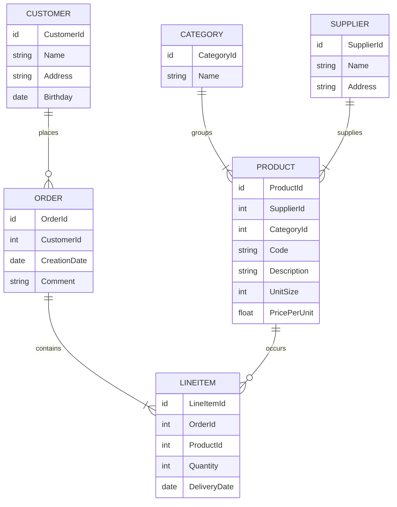
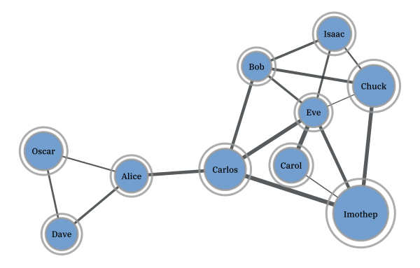
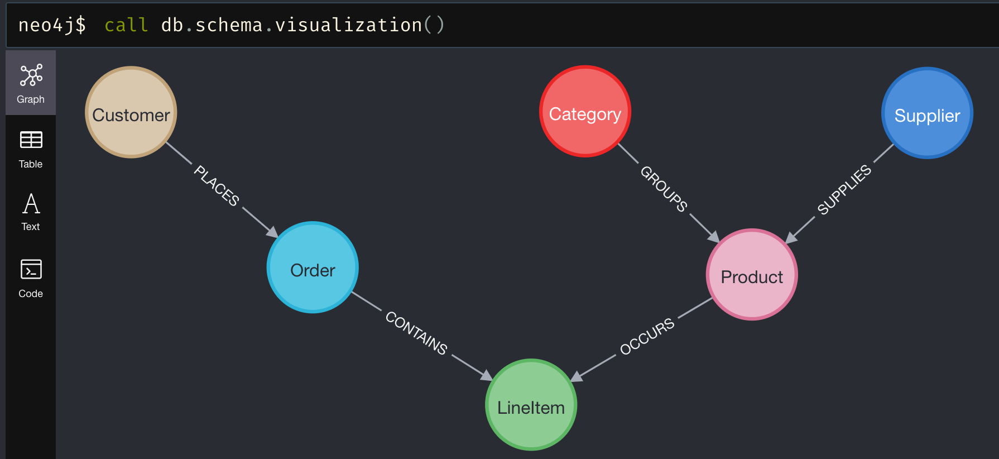

# Abstract
The goal of this project is to analyze the differences between relational and graph-based database management systems. The representatives used as concrete implementation of these two paradigms will be PostgreSQL (relational) and Neo4j (graph-based).

The first part of this work will elaborate on the background of these technologies with a focus on the history, popular use cases, as well as (dis)advantages. Furthermore, the key differences will be outlined in the applicable query languages, namely SQL and Cypher.

The main part is dedicated to a setup and execution of a benchmarking test. The goal is to measure and compare the performances of standard database statements used to create, read, update, and delete data. Therefore, a test console application was developed using [Go](https://go.dev/) in order to consistently and automatically test the given statements with database instances running in [Docker](https://www.docker.com/).

Finally, the benchmarking results are consolidated and interpreted. The findings will be discussed alongside concrete recommendations in order to facilitate future decisions on the given database paradigm.

# Relational Database Systems `20%`

Relational databases belong to the most popular database management systems (DBMS) nowadays. Every computer science freshman will address this data storage paradigm in an early stage and everybody in the professional world that relies on computer systems has most probably had (un)consciously interacted with it before. It was first introduced by Ted Codd in 1970 [[1]](#1). Roughly ten years later, its first commercial model became available in form of IBM's Orcale DBMS. Micorosft followed with its own products such as SQLServer and Access. Besides this, free and open-source solutions like MySQL and PostgreSQL started to emerge. [[2]](#2)

Relationally storing data first and foremost means that every piece of unique information ideally is stored only once in our database and then referenced multiple times to wherever it is required to be. This referencing works with so-called primary keys (PK) and foreign keys (FK), where the latter serves as a pointer to the actual information. The following example describes such a relationally linked data structure utilizing a merchant use case.



<h6 align="center">Possible Entity-Relationship Diagram of a Merchant's Database</h6>

Each box in this entity-relationship diagram (ERD) represents an *entity*, which is in practice nothing else than a table where each row decribes0 a distinct tuple. The listed attributes in the boxes correspond to the columns of the table, also known as *attributes*. The connecting lines specify the *relationships* between the entities, whereas the line endings denote the corresponding *cardinality* using [Crow's Foot Notation](https://vertabelo.com/blog/crow-s-foot-notation/). A customer, for instance, can place zero or many orders. Each order contains at least one line item. A supplier, on the other hand, delivers one or more products, while each product belongs to exactly one category. Finally, a product can occur zero or many times in the great list of line items.

With this relational data structure, the absence of informational redundancy is ensured. In the context of DBMS, the structure is referred to as *schema*, and the process of designing is called *database normalization*. Working with normalized data is not only storage efficient but also allows keeping the operational costs that might occur when updating information at a minimum. Imagine a concrete product has been ordered many thousand times and suddenly, the merchant would like to rename this product. Thanks to the relational structure, the update operation will only affect one single storage cell, namely in the product entity on the corresponding row-column intersection. The thousandfold mentions of this product in the line item entity will remain unaffected as the referencing foreign key `ProductId` will not change. Only the referenced information does.


## History


## Use Cases

## 

# Graph-Based Database Systems `20%`
- History
- Use Cases
- (Dis)Advantages

With rising trends in amounts and connections of data, the classic relational database management systems seemed not to be the ideal choice. In the field of mathematics, graph theory was already established and algorithms to assess networks of connected nodes became more and more popular. The core business model of emerging companies such as Twitter or Facebook was and still is based on data that can be represented ideally as graphs. For instance, think of friendship relations among people as shown in the figure below. Every person represents a node and the connecting lines (a.k.a. edges) indicate the friendship relations among them. The nodes are attributed be the person's name and the thickness of the edges describes, for instance, how close this friendship is.

<p align="center">  </p>
<h6 align="center">Friendships as Weighted Graph <a href="#3">[3]</a></h6>

Capturing graph-based data domains in a relational DBMS invokes certain limitations regarding ease of querying, computational complexity, and efficiency [[10]](#10). Graph-based database systems overcome these limitations as they store such graph-based information natively. A popular implementation of such a system is [neo4j](https://neo4j.com/). Other than in relational DBMS, neo4j allows heterogenous sets of attribute on both nodes and relationships. This implies that there is also no database schema to be specified beforehand. One simply creates attributed nodes and the also attributed relationships among them in order to start working with a graph database [[11]](#11).

One of the most remarkable advantage is the application of graph algorithms as they are uniquely well suited to reveal and understand patterns in highly connected datasets. Possible real-world problems may include uncovering vulnerable components in a network, discovering unseen dependencies, identifying bottlenecks, revealing communities based on behavior patterns, or specifying the cheapest route through a network [[12]](#12).


<!--
<p align="center">  </p>
<h6 align="center">Merchand's Database Use Case in neo4j</h6>
-->


# Query Languages `20%`
- General way of working
- Data Definition Language
- Data Manipulation Language


# Benchmark `40%`
- Intro
- Important to Know (e.g. warm up, caching, etc.)


## Strategy and Goals
- Explanation of Automatised Tests 
- Evaluation Criteria (Performance)

## Setup
- Hardware
- Software
- system setup (docker, etc.)
- Sample Data

### Docker
Docker allows the most lightweight and easiest database setup. Just download Docker and execute the following commands.

```console
# start mysql (user=root, password=password, db=localhost:3306)
docker run --name gobench-mysql -p 3306:3306 -e MYSQL_ROOT_PASSWORD=password -d mysql

# start postgres (user=postgres, password=password, db=localhost:5432)
docker run --name gobench-postgres -p 5432:5432 -e POSTGRES_PASSWORD=password -d postgres

# start neo4j (user=neo4j, password=password, db=localhost:7687, browser=localhost:7474)
docker run --name gobench-neo4j -p7474:7474 -p7687:7687 -e NEO4J_AUTH=neo4j/password -d neo4j
```

To remove all containers and the associated volumes again, use the following two commands.

```console
docker rm -f $(docker ps -a -q)
docker volume rm $(docker volume ls -q)
```

### Command Line Interface

```console
go run main.go neo4j --host 127.0.0.1 --port 7687 --user neo4j --pass password --iter 1000 --writecsv "neo4j.csv" \
&& go run main.go postgres --host 127.0.0.1 --port 5432 --user postgres --pass password --iter 1000 --writecsv "postgres.csv" \
&& go run main.go mysql --host 127.0.0.1 --port 3306 --user root --pass password --iter 1000 --writecsv "mysql.csv" \
&& go run main.go mergecsv --rootDir "." --targetFile "./merged.csv" \
&& go run main.go createcharts --dataFile "./merged.csv"
```


## Results
- Consolidation
- Interpretation

# Discussion
- Are Graph-Based really always better?

A data schema in a relational DBMS should not directly be translated into a graph-based DBMS, as there might be entities which dispensable as the information they hold is modeled using the attributed relationships among nodes. The tutorial [Import Relational Data Into Neo4j](https://neo4j.com/developer/guide-importing-data-and-etl/) nicely illustrates this using the famous Northwind database. 


# Acknowledgements
Thanks to Simon Jürgensmeyer for his work on [dbbench](https://github.com/sj14/dbbench), which according to him was initially ispired by [Fale's post]([Fale](https://github.com/cockroachdb/cockroach/issues/23061#issue-300012178)), [pgbench](https://www.postgresql.org/docs/current/pgbench.html) and [MemSQL's dbbench](https://github.com/memsql/dbbench). His project served as a basis for this work.


# References


<a id="1">[1]</a> Codd, E. F. (2002). A Relational Model of Data for Large Shared Data Banks. In M. Broy & E. Denert (Eds.), Software Pioneers (pp. 263–294). Springer Berlin Heidelberg. https://doi.org/10.1007/978-3-642-59412-0_16

<a id="2">[2]</a> Elmasri, R., & Navathe, S. (2011). Fundamentals of Database Systems (6th ed). Addison-Wesley.

<a id="3">[3]</a> Peixoto, T. P. (n.d.). What is graph-tool? Graph-Tool. Retrieved 20 March 2022, from https://graph-tool.skewed.de/

<a id="10">[10]</a> Robinson, I., Webber, J., & Eifrem, E. (2015). Graph Databases: New Opportunities for Connected Data.

<a id="11">[11]</a> Stopford, B. (2012, August 17). Thinking in Graphs: Neo4J. http://www.benstopford.com/2012/08/17/thinking-in-graphs-neo4j/

<a id="12">[12]</a> Needham, M., & Hodler, A. E. (2019). Graph Algorithms: Practical Examples in Apache Spark and Neo4j (First edition). O’Reilly Media.

<a id="99">[??]</a> Chauhan, C., & Kumar, D. (2017). PostgreSQL High Performance Cookbook: Mastering query optimization, database monitoring, and performance-tuning for PostgreSQL. Packt Publishing.

<a id="99">[??]</a> Gregg, B. (2020). Systems Performance: Enterprise and the Cloud (Second). Addison-Wesley.
 
