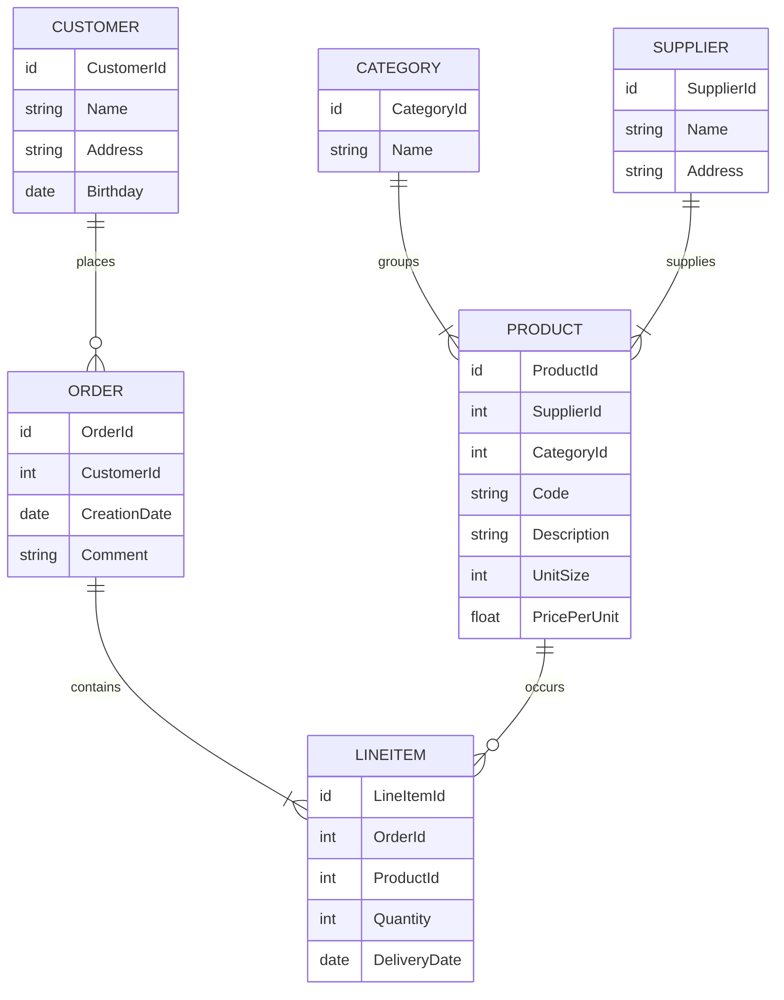
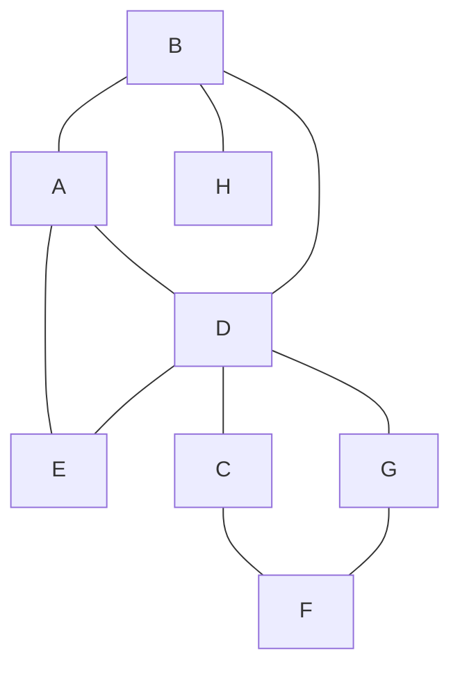

# Abstract
The goal of this project is to analyze the differences between relational and graph-based database management systems. The representatives used as concrete implementation of these two paradigms will be PostgreSQL (relational) and Neo4j (graph-based).

The first part of this work will elaborate on the background of these technologies with a focus on the history, popular use cases, as well as (dis)advantages. Furthermore, the key differences will be outlined in the applicable query languages, namely SQL and Cypher.

The main part is dedicated to a setup and execution of a benchmarking test. The goal is to measure and compare the performances of standard database statements used to create, read, update, and delete data. Therefore, a test console application was developed using [Go](https://go.dev/) in order to consistently and automatically test the given statements with database instances running in [Docker](https://www.docker.com/).

Finally, the benchmarking results are consolidated and interpreted. The findings will be discussed alongside concrete recommendations in order to facilitate future decisions on the given database paradigm.

# Relational Database Systems `20%`

Relational databases belong to the most popular database management systems (DBMS) nowadays. Every computer science freshman will address this data storage paradigm in an early stage and everybody in the professional world that relies on computer systems has most probably had (un)consciously interacted with it before. It was first introduced by Ted Codd in 1970 [[1]](#1). Roughly ten years later, its first commercial model became available in form of IBM's Orcale DBMS. Micorosft followed with its own products such as SQLServer and Access. Besides this, free and open-source solutions like MySQL and PostgreSQL started to emerge. [[2]](#2)

Relationally storing data first and foremost means that every piece of unique information ideally is stored only once in our database and then referenced multiple times to wherever it is required to be. This referencing works with so-called primary keys (PK) and foreign keys (FK), where the latter serves as a pointer to the actual information. The following example describes such a relationally linked data structure utilizing a merchant use case.



<h6 align="center">Possible Entity-Relationship Diagram of a Merchant's Database</h6>

Each box in this entity-relationship diagram (ERD) represents an *entity*, which is in practice nothing else than a table where each row decribes0 a distinct tuple. The listed attributes in the boxes correspond to the columns of the table, also known as *attributes*. The connecting lines specify the *relationships* between the entities, whereas the line endings denote the corresponding *cardinality* using [Crow's Foot Notation](https://vertabelo.com/blog/crow-s-foot-notation/). A customer, for instance, can place zero or many orders. Each order contains at least one line item. A supplier, on the other hand, delivers one or more products, while each product belongs to exactly one category. Finally, a product can occur zero or many times in the great list of line items.

With this relational data structure, the absence of informational redundancy is ensured. In the context of DBMS, the structure is referred to as *schema*, and the process of designing is called *database normalization*. Working with normalized data is not only storage efficient but also allows keeping the operational costs that might occur when updating information at a minimum. Imagine a concrete product has been ordered many thousand times and suddenly, the merchant would like to rename this product. Thanks to the relational structure, the update operation will only affect one single storage cell, namely in the product entity on the corresponding row-column intersection. The thousandfold mentions of this product in the line item entity will remain unaffected as the referencing foreign key `ProductId` will not change. Only the referenced information does.


## History


## Use Cases

## 

# Graph-Based Database Systems `20%`
- History
- Use Cases
- (Dis)Advantages

<!--- mermaid version of a graph

-->


<p align="center">  </p>
<h6 align="center">Friendships as Weighted Graph <a href="#3">[3]</a></h6>

# Query Languages `20%`
- General way of working
- Data Definition Language
- Data Manipulation Language

# Benchmark `40%`
- Intro
- Important to Know (e.g. warm up, caching, etc.)

## Strategy and Goals
- Explanation of Automatised Tests 
- Evaluation Criteria (Performance)

## Setup
- Hardware
- Software
- system setup (docker, etc.)
- Sample Data

### Docker
Docker allows the most lightweight and easiest database setup. Just download Docker and execute the following commands.

```console
# start mysql (user=root, password=password, db=localhost:3306)
docker run --name gobench-mysql -p 3306:3306 -e MYSQL_ROOT_PASSWORD=password -d mysql

# start postgres (user=postgres, password=password, db=localhost:5432)
docker run --name gobench-postgres -p 5432:5432 -e POSTGRES_PASSWORD=password -d postgres

# start neo4j (user=neo4j, password=password, db=localhost:7687, browser=localhost:7474)
docker run --name gobench-neo4j -p7474:7474 -p7687:7687 -e NEO4J_AUTH=neo4j/password -d neo4j
```

To remove all containers and the associated volumes again, use the following two commands.

```console
docker rm -f $(docker ps -a -q)
docker volume rm $(docker volume ls -q)
```


## Results
- Consolidation
- Interpretation

# Discussion
- Are Graph-Based really always better?

# Acknowledgements
Thanks to Simon Jürgensmeyer for his work on [dbbench](https://github.com/sj14/dbbench), which according to him was initially ispired by [Fale's post]([Fale](https://github.com/cockroachdb/cockroach/issues/23061#issue-300012178)), [pgbench](https://www.postgresql.org/docs/current/pgbench.html) and [MemSQL's dbbench](https://github.com/memsql/dbbench). His project served as a basis for this work.


# References


<a id="1">[1]</a> Codd, E. F. (1970). A Relational Model for Large Shared
Data Banks.

<a id="2">[2]</a> Elmasri, R., & Navathe, S. B. (2010). Fundamentals of database systems (6th ed.). Pearson.

<a id="3">[3]</a> Peixoto, Tiago P., https://graph-tool.skewed.de/, retrieved on March 20. 2022


