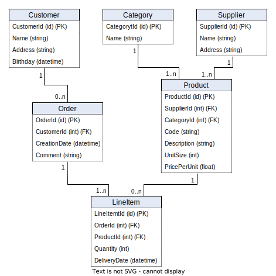
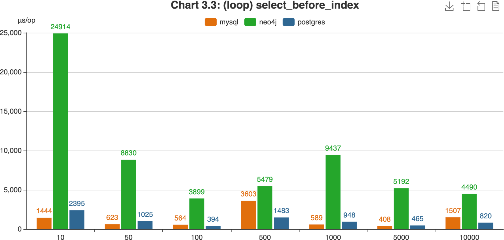

<!-- _class: custom1 -->
<!-- footer: also available as [PDF](https://github.com/RomanBoegli/godbbench/raw/main/docs/slides.pdf) --->
<style scoped>
table { font-size:0.8em;  min-width: 100%; }
th { display:none;}
</style>

# Automated Database Benchmarking Tool
###### Performance Analysis of MySQL, PostgreSQL and Neo4j using Different Data Scenarios
###

.     | .
:-----|:------
**Institute** | Eastern Switzerland University of Applied Science
**Program** | MSE Computer Science
**Module** | DB Seminar
**Author** | Roman Bögli
**Supervisor** | Prof. Stefan F. Keller
**Date** | 13. June 2022


---
<!-- footer: ""  -->

# Content

- Relational DBMS vs. Graph-Based DBMS
- Tool `godbbench`
- Synthetic Script & Substitution
- Custom Scripts (`merchant`, `employees`)
- Automation
- Result Analysis
- Conclusion & Future Work

----


# Relational DBMS

- Tables are entities
- Relationships using keys
- Homogenous data 
through schema
- Ideal for **predefinable** & **rigid** 
data use cases




----


# Graph-Based DBMS

- Attributed nodes and edges
- Relationships are 
first-class citizen
- Heterogenous data 
(schema-less)
- Ideal for **alternating** &  
**highly connected** 
data use cases


----


# Query Languages

Query adult customers
```sql
-- SQL
SELECT * FROM Customer c WHERE c.Age >= 18

-- Cypher
MATCH (c:Customer) WHERE c.Age > 18 RETURN c;
```


Show top clients based on revenue
```sql
-- SQL
SELECT c.CustomerId, c.Name, SUM(p.Total) FROM Customer c 
INNER JOIN Purchase p on c.CustomerId = p.CustomerId 
GROUP BY c.CustomerId, c.Name ORDER BY SUM(p.Total) DESC

-- Cypher
MATCH (c:Customer)-[:MAKES]->(p:Purchase)
RETURN c.Name, SUM(p.Total) AS TotalOrderValue ORDER BY TotalOrderValue DESC
```


----

# System Setup

- Requirements:
  - [Docker](https://docs.docker.com/get-docker/)
  - [Go](https://go.dev/doc/install)
  - [godbbench](https://github.com/RomanBoegli/godbbench)


----

# Command Line Interface (CLI)

- Open terminal and navigate to the location of `godbbench.go`
`$ cd ~/path/to/godbbench/cmd`

- Interact with `go run godbbench.go` to see flags


----

# Possilbe CLI Commands

```ps
# run synthetic INSERT and SELECT statements against MySQL, each 100x
$ go run godbbench.go mysql --host 127.0.0.1 --port 3306 --user "root" \
        --pass "password" --iter 100 --run "inserts selects"
```

```ps
# run statemets of custom script against Postgres, save results in file
$ go run godbbench.go postgres --host 127.0.0.1 --port 5432 --user "postgres" \
        --pass "password" --iter 100 --script "./path/to/mysql.sql" \
        --writecsv "./path/to/results/mysql.csv"
```

```ps
# merge serveral result files
$ go run godbbench.go mergecsv \
        --rootDir "~/path/with/csv-files/to-be-merged"
        --targetFile "~/anypath/allresults.csv"
```

```ps
# visualize the benchmarking results
$ go run godbbench.go createcharts \
        --dataFile "~/anypath/allresults.csv" --charttype "line"
```

----

# Statement Substitutions

Allows for dynamic creation of queries without specifying thousands of structurally identical DBMS statements.


#### Example

```SQL
INSERT INTO Customer (Id, Name, Birthday) 
VALUES ( {{.Iter}}, '{{call .RandString 3 10 }}', '{{call .RandDate }}');
```

will become...

```SQL
INSERT INTO Customer (Id, Name, Birthday) VALUES ( 1, 'd9cfApqFe', '1999-11-25');
```


----
<style scoped>
table { font-size:0.83em;  min-width: 110%; }
</style>

# Substitution Possibilities

Declaration | Substitution
:---------|:------------
`{{.Iter}}`| Counter that starts with 1 and ends with the specified multiplicity<br/>of the given benchmark.
`{{call .RandInt64}}`|Returns a random non-negative value of type [Int64](https://pkg.go.dev/builtin#int64).
`{{call .RandFloat64}}`|Returns a random value within the interval [0.0,1.0) as [Float64](https://pkg.go.dev/builtin#float64).
`{{call .RandIntBetween 1 42}}`| Returns a random integer between 1 and 42 ([Int32](https://pkg.go.dev/builtin#int32)).
`{{call .RandFloatBetween 0.8 9.9}}`| Returns a random float between 0.8 and 9.9 ([Float64](https://pkg.go.dev/builtin#float64)).
`{{call .RandString 1 9}}`| Returns a random string with a length between 1 and 9 characters.
`{{call .RandDate}}`|Returns a random date as string (yyyy-MM-dd) between <br/>`1970-01-01` and `2023-01-01`.

----

# Custom Script (`merchant`)

```SQL
-- INIT (illustration purposes)
\benchmark once \name initialize
DROP SCHEMA IF EXISTS godbbench CASCADE; CREATE SCHEMA godbbench;
CREATE TABLE godbbench.order (OrderId INT PRIMARY KEY, CustomerId INT NOT NULL, ... );

-- INSERTS (illustration purposes)
\benchmark loop 1.0 \name inserts
INSERT INTO godbbench.Order (OrderId, CustomerId, CreationDate, Comment) 
VALUES( {{.Iter}}, (SELECT CustomerId FROM godbbench.Customer ORDER BY RANDOM() LIMIT 1), 
        '{{call .RandDate }}', '{{call .RandString 0 50 }}');

-- SELECTS
\benchmark loop 1.0 \name select_simple
SELECT * FROM godbbench.Customer WHERE CustomerId = {{.Iter}} 

\benchmark loop 1.0 \name select_medium
SELECT * FROM godbbench.Product p JOIN godbbench.Supplier s ON ...
  
\benchmark loop 1.0 \name select_complex
SELECT c.CustomerId, c.Name, SUM(li.Quantity * p.UnitSize * p.PricePerUnit) as  ...

-- CLEAN (illustration purposes)
\benchmark once \name clean
DROP SCHEMA IF EXISTS godbbench CASCADE;
```


----


----


**Attention:** 
Relational data schemas should not directly be mapped into a graph-world. 
Relationships in graph-based DBs are first-class citizen that can hold information by itself.
 

----


# Custom Script (`employees`)

Show all subordinates of an employee (tree queries)

```SQL
-- use WITH RECURISON notation in PostgresSQL (similar in MySQL)
WITH RECURSIVE hierarchy AS (
    SELECT employee_id, first_name, boss_id, 0 AS level 
    FROM employee 
    WHERE employeeId = {{.Iter}}
  UNION ALL 
    SELECT e.employee_id, e.first_name, e.boss_id, hierarchy.level + 1 AS level 
    FROM employee e JOIN hierarchy ON e.boss_id = hierarchy.employee_id 
) SELECT * FROM hierarchy;
INSERT INTO employee (first_name, boss_id, salary) VALUES ('BigBoss', null, 999999);

-- simpler query using Cypher
MATCH (boss)-[:BOSS_OF*1..]->(sub) WHERE boss.employeeId={{.Iter}} RETURN sub;
```
####
> see example graph on next slide ...

----


---

<!-- backgroundColor: white -->

# Automation

```ps
$ bash bashscript.sh
```


>see demo on next slide...

----


----

# Result Analysis
<!-- footer: 1 second (s) = 1'000'0000 microseconds (μs)  -->
Generating a `chart.html` file to visualize
- average amount of microseconds (`μs`) per benchmark (the lower the better)
- operations per second (the higher the better)
- microseconds per operation (the lower the better) 


----



----


----

<!-- footer: ""  -->

# Conclusion & Future Work

- todo

----


# References
<!-- _class: custom -->

- Bechberger, D., & Perryman, J. (2020). Graph databases in Action: Examples in Gremlin. Manning.
- Bush, J. (2020). Learn SQL Database Programming: Query and manipulate databases from popular relational database servers using SQL.
- Chauhan, C., & Kumar, D. (2017). PostgreSQL High Performance Cookbook: Mastering query optimization, database monitoring, and performance-tuning for PostgreSQL. Packt Publishing.
- Codd, E. F. (2002). A Relational Model of Data for Large Shared Data Banks. In M. Broy & E. Denert (Eds.), Software Pioneers (pp. 263–294). Springer Berlin Heidelberg. https://doi.org/10.1007/978-3-642-59412-0_16
- Elmasri, R., & Navathe, S. (2011). Fundamentals of Database Systems (6th ed). Addison-Wesley.
- Fleming, P. J., & Wallace, J. J. (1986). How not to lie with statistics: The correct way to summarize benchmark results. Communications of the ACM, 29(3), 218–221. https://doi.org/10.1145/5666.5673
- Gray, J. (Ed.). (1994). The Benchmark Handbook for Database and Transaction Processing Systems (2. ed., 2. [print.]). Morgan Kaufmann.
- Gregg, B. (2020). Systems Performance: Enterprise and the Cloud (Second). Addison-Wesley.
- Meier, A., & Kaufmann, M. (2019). SQL & NoSQL Databases: Models, Languages, Consistency Options and Architectures for Big Data Management. Springer Vieweg.
- Needham, M., & Hodler, A. E. (2019). Graph Algorithms: Practical Examples in Apache Spark and Neo4j (First edition). O’Reilly Media.
- Peixoto, T. P. (n.d.). What is graph-tool? Graph-Tool. Retrieved 20 March 2022, from https://graph-tool.skewed.de/
- Robinson, I., Webber, J., & Eifrem, E. (2015). Graph Databases: New Opportunities for Connected Data.
- Scalzo, B. (2018). Database Benchmarking and Stress Testing: An Evidence-Based Approach to Decisions on Architecture and Technology. Springer Science+Business Media, LLC.
- Stopford, B. (2012, August 17). Thinking in Graphs: Neo4J. http://www.benstopford.com/2012/08/17/thinking-in-graphs-neo4j/


----
<!-- _class: lead -->
# Thanks

