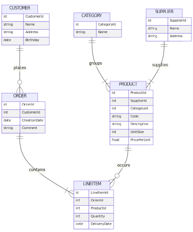

# Command Line Interface Tool for Automatized Database Benchmarks
##

**Institute:**&emsp;&nbsp;&nbsp;&nbsp;&nbsp;&nbsp;&nbsp;&nbsp;Eastern Switzerland University of Applied Science
**Program:**&emsp;&emsp;&nbsp; MSc Computer Science
**Course:**&emsp;&emsp;&emsp;DB Seminar
**Author:**&emsp;&emsp;&emsp; Roman Bögli
**Supervisor:**&emsp;&nbsp; Prof. Stefan F. Keller
**Stage:**&emsp;&emsp;&emsp;&nbsp;&nbsp; *interim*
**Date:**&emsp;&emsp;&emsp;&emsp; April 6, 2023


---

# Content

1. Relational DBMS
2. Graph-Based DBMS
3. Query Languages
4. System Setup
5. Command Line Interface
6. Result Analysis
7. Conclusion

----


# Relational DBMS

- tables are entities
- relationships using keys
- homogenous data through schema




----


# Graph-Based DBMS

- attributed nodes and edges
- relationships are first class elements
- heterogenous data (schema-less)


----


# Query Languages

Query adult customers
```sql
-- SQL
SELECT * FROM Customer c WHERE c.Age >= 18

-- Cyper
MATCH (c:Customer) WHERE c.Age > 18 RETURN c;
```


Show top clients based on revenue
```sql
-- SQL
SELECT c.CustomerId, c.Name, SUM(p.Total) FROM Customer c 
INNER JOIN Purchase p on c.CustomerId = p.CustomerId 
GROUP BY c.CustomerId, c.Name ORDER BY SUM(p.Total) DESC

-- Cyper
MATCH (c:Customer)-[:MAKES]->(p:Purchase)
RETURN c.Name, SUM(p.Total) AS TotalOrderValue ORDER BY TotalOrderValue DESC
```


----

# System Setup
tbd

----

# Command Line Interface
tbd

----

# Result Analysis
tbd

----

# Conclusion
tbd


----

thanks!