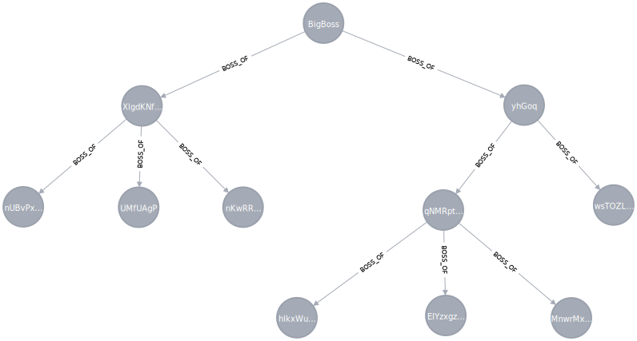
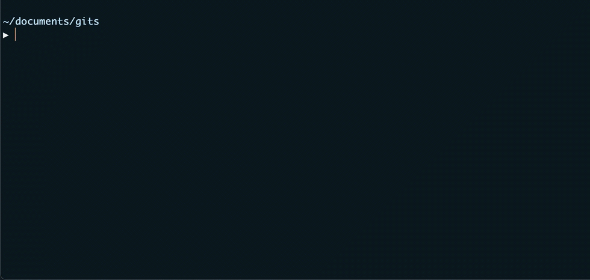
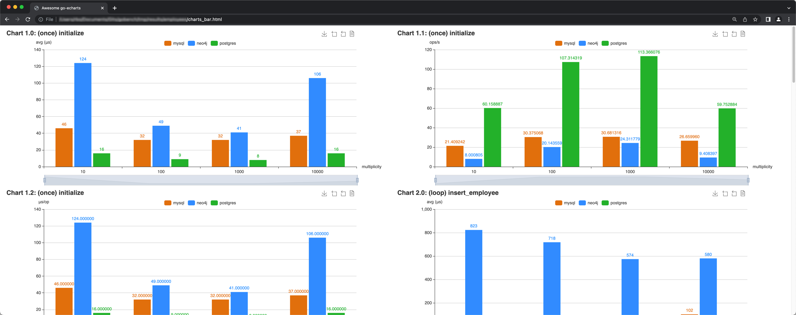
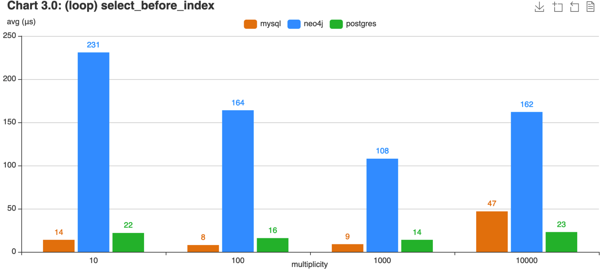
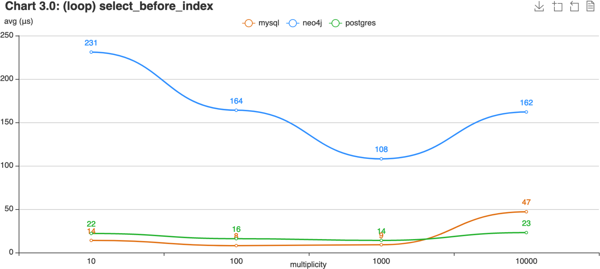

<!-- _class: custom1 -->

# Performance Analysis of MySQL, Neo4j, and Postgres
###### Performance Analysis of MySQL, Neo4j, and Postgres using Different Data Scenarios
###

**Institute:**&emsp;&nbsp;&nbsp;&nbsp;&nbsp;&nbsp;&nbsp;&nbsp;Eastern Switzerland University of Applied Science
**Program:**&emsp;&emsp;&nbsp; MSc Computer Science
**Course:**&emsp;&emsp;&emsp;DB Seminar
**Author:**&emsp;&emsp;&emsp; Roman Bögli
**Supervisor:**&emsp;&nbsp; Prof. Stefan F. Keller
**Stage:**&emsp;&emsp;&emsp;&nbsp;&nbsp; *interim*
**Date:**&emsp;&emsp;&emsp;&emsp; 14. April 2023


---

# Content

- Relational DBMS vs. Graph-Based DBMS
- Tool `gobench`
- Synthetic Script & Substitution
- Custom Scripts (`merchant`, `employees`, `friends`)
- Automation
- Result Analysis
- Open Work

----


# Relational DBMS

- Tables are entities
- Relationships using keys
- Homogenous data <br>through schema


----


# Graph-Based DBMS

- Attributed nodes and edges
- Relationships are first class elements
- Heterogenous data <br>(schema-less)


----


# Query Languages

Query adult customers
```sql
-- SQL
SELECT * FROM Customer c WHERE c.Age >= 18

-- Cyper
MATCH (c:Customer) WHERE c.Age > 18 RETURN c;
```


Show top clients based on revenue
```sql
-- SQL
SELECT c.CustomerId, c.Name, SUM(p.Total) FROM Customer c 
INNER JOIN Purchase p on c.CustomerId = p.CustomerId 
GROUP BY c.CustomerId, c.Name ORDER BY SUM(p.Total) DESC

-- Cyper
MATCH (c:Customer)-[:MAKES]->(p:Purchase)
RETURN c.Name, SUM(p.Total) AS TotalOrderValue ORDER BY TotalOrderValue DESC
```


----

# System Setup

- Requirements:
  - [Docker](https://docs.docker.com/get-docker/)
  - [Go](https://go.dev/doc/install)
  - [gobench](https://github.com/RomanBoegli/gobench)


----

# Command Line Interface (CLI)

- Open terminal and navigate to the location of `main.go`
`$ cd ~/path/to/gobench/cmd`

- Interact with `go run main.go` to see flags


----

# Possilbe CLI Commands

```ps
# run synthetic INSERT and SELECT statements against MySQL, each 100x
$ go run main.go mysql --host 127.0.0.1 --port 3306 --user "root" \
        --pass "password" --iter 100 --run "inserts selects"
```

```ps
# run statemets of custom script against Postgres, save results in file
$ go run main.go postgres --host 127.0.0.1 --port 5432 --user "postgres" \
        --pass "password" --iter 100 --script "./path/to/mysql.sql" \
        --writecsv "./path/to/results/mysql.csv"
```

```ps
# merge serveral result files
$ go run main.go mergecsv \
        --rootDir "~/path/with/csv-files/to-be-merged"
        --targetFile "~/anypath/allresults.csv"
```

```ps
# visualize the benchmarking results
$ go run main.go createcharts \
        --dataFile "~/anypath/allresults.csv" --charttype "line"
```

----

# Custom Script (`merchant`)

```SQL
-- INIT
\benchmark once \name initialize
DROP SCHEMA IF EXISTS gobench CASCADE;
CREATE SCHEMA gobench;
CREATE TABLE gobench.Customer (CustomerId INT PRIMARY KEY, Name VARCHAR(10), ... );
CREATE TABLE gobench.order (OrderId INT PRIMARY KEY, CustomerId INT NOT NULL, ... );

-- INSERTS
\benchmark loop 1.0 \name inserts
INSERT INTO gobench.Customer (CustomerId, Name, Birthday) 
VALUES ( {{.Iter}}, '{{call .RandString 3 10 }}', '{{call .RandDate }}');

INSERT INTO gobench.Order (OrderId, CustomerId, CreationDate, Comment) 
VALUES( {{.Iter}}, (SELECT CustomerId FROM gobench.Customer ORDER BY RANDOM() LIMIT 1), 
        '{{call .RandDate }}', '{{call .RandString 0 50 }}');

-- SELECTS
\benchmark loop 1.0 \name select_simple
SELECT * FROM gobench.Customer WHERE CustomerId = {{.Iter}} 

-- CLEAN
\benchmark once \name clean
DROP SCHEMA IF EXISTS gobench CASCADE;
```

----

# Statement Substitutions

Sequences of the following patterns will be substituted before the statement is executed:

`{{.Iter}}` --> The iteration counter. Will return 1 when `\benchmark once`.
`{{call .RandIntBetween 1 100}}` --> Random integer between `1` and `100`.
`{{call .RandFloatBetween 0 1}}` --> Random float between `0` and `1`.
`{{call .RandString 3 15}}` --> Random string with length between `3` and `15`.
`{{call .RandDate}}` --> Random date.

----

# Custom Script (`employees`)

Show all subordinates of an employee (tree queries)

```SQL
-- use WITH RECURISON notation in Postgres (similar in MySQL)
WITH RECURSIVE hierarchy AS (
    SELECT employeeId, firstname, boss_id, 0 AS level 
    FROM gobench.employee 
    WHERE employeeId = {{.Iter}}
  UNION ALL 
    SELECT e.employeeId, e.firstname, e.boss_id, hierarchy.level + 1 AS level 
    FROM gobench.employee e JOIN hierarchy ON e.boss_id = hierarchy.employeeId 
) 
SELECT * FROM hierarchy;

-- simpler query using Cypher
MATCH (boss)-[:BOSS_OF*1..]->(sub) WHERE boss.employeeId={{.Iter}} RETURN sub;
```

####

> see example graph on next slide ...

----



----

# Custom Script (`friends`)

Show the shortest acquaintance path of two people (cyclic graph queries)

##

```golang
*************************************************************************
************************** `WORK IN PROGRESS` ***************************
*************************************************************************
```
----

# Automation

```ps
$ bash bashscript.sh
```


>see demo on next slide...

----



----

# Result Analysis
<!-- footer: 1 second (s) = 1'000'0000 microseconds (μs)  -->
Generating a `chart.html` file to visualize
- average amount of microseconds (`μs`) per benchmark (the lower the better)
- operations per second (the higher the better)
- microseconds per operation (the lower the better) 




----



----



----

<!-- footer: ""  -->

# Open Work
##

CLI Tool | Custom Scripts | Writing
:--------|:---------------|:-------
✅ Benchmarking<br>✅ Result consolidation<br>✅ Chart generation <br>  <br><br>| ✅ `merchant` <br> ✅ `employees`<br>⭕️ `friends` <br><br><br>| ✅ Abstract <br>✅ Intro <br>⭕️ System specs & setup <br>⭕️ Benchmarking approaches <br> ⭕️ Result analysis & conclusion


----

<!-- _class: lead -->
# Thanks
